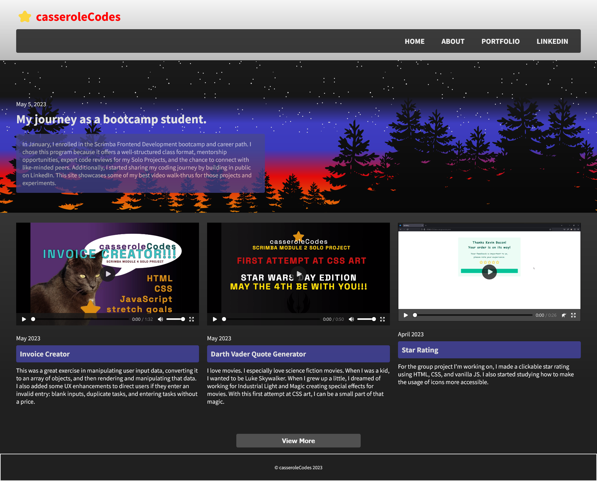
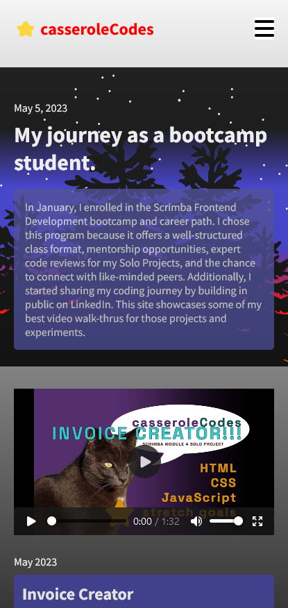
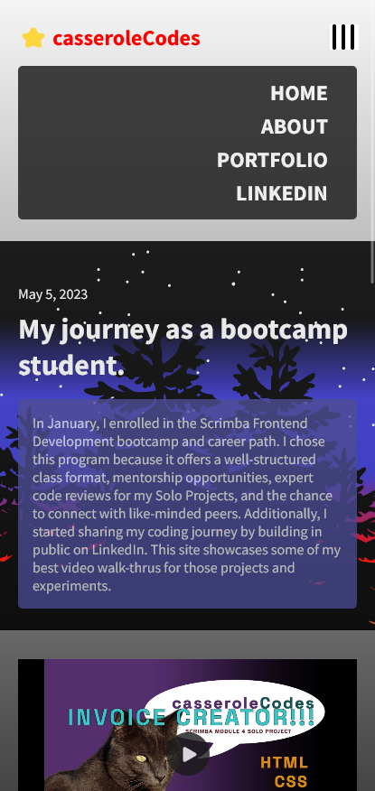
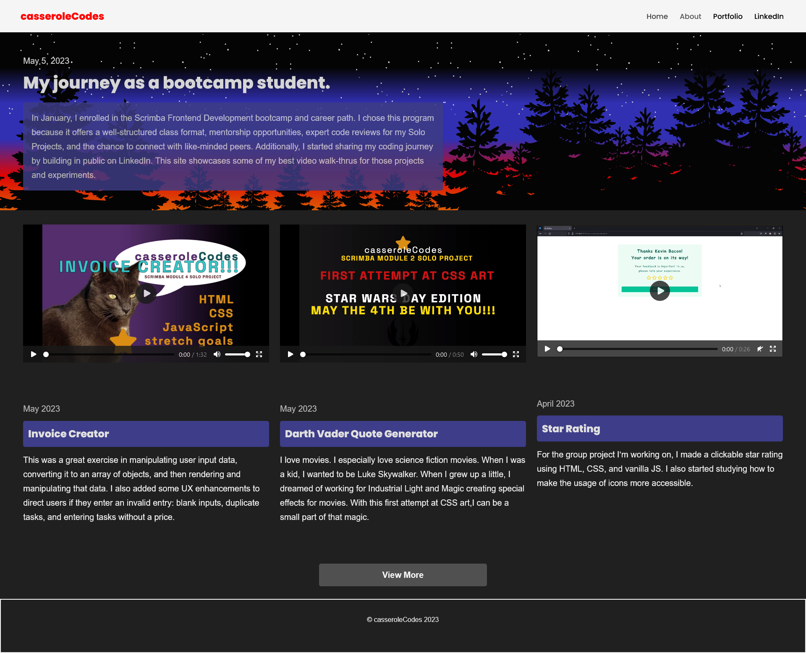
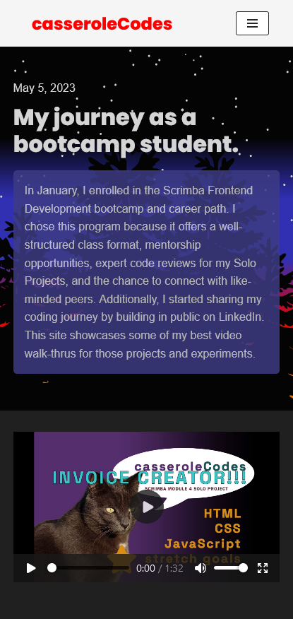
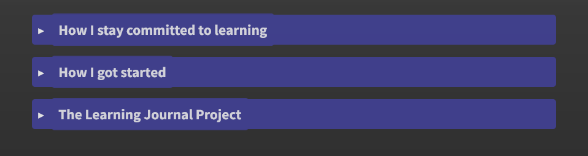
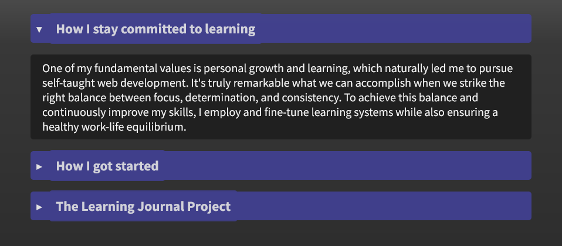

 ## Table of contents

- [Overview](#overview)
  - [The challenge](#the-challenge)
  - [Screenshot](#screenshot)
  - [Links](#links)
- [My process](#my-process)
  - [Built with](#built-with)
  - [What I learned](#what-i-learned)
  - [UI/UX and Accessiblity Notes](#UI-UX-and-accessibility)
  - [Continued development](#continued-development)
  - [Useful resources](#useful-resources)
- [Author](#author)
- [Acknowledgments](#acknowledgments)


### Overview

Scrimba M6 solo project - Learning Journal
[Scrim](https://scrimba.com/learn/frontend/solo-project-learning-journal-cNP6Gwc6)

### The challenge

Requirements:
- Homepage, mobile/desktop
- Article page, mobile/desktop
- About me page, mobile/desktop
- each page has a header with logo and a footer

- Build each page from "scratch"
- Make all pages responsive
  - relative units
  - mobile-first design
  - media queries
  - flexbox/css grid
  - viewport meta tag

Stretch goals
- make it your own
- add custom images
- make the content about your learning experiences
- add new pages / links
- JS show all but six posts, show all with "view more" link
- responsive navigation displaying a "hamburger menu" on smaller screens
  - toggles navigation from closed to open

Personal stretch goal
- built both scratch site and WordPress.org site
- use personal brand
- use #buildinginpublic content from LinkedIn: videos and basic text 

[Figma file](https://www.figma.com/file/Ny8pJOEotrbZQ8i4u80iAS/Learning-Journal%2FBlog-(Copy)?node-id=0-1&t=5XaG2eBKgyfwxCyo-0)

### Screenshot

<h2>Scratch Site Desktop</h2>



<br>

<h2>Scratch Site Mobile </h2>



<br>

<h2>Scratch Site Mobile Hamburger Menu</h2>



<br>

<h2>WordPress Site Desktop</h2>



<br>

<h2>WordPress Site Mobile</h2>



<br>

### Links

-[Scrim](https://scrimba.com/scrim/co7274bc782bb9c0e125aa76b)s
-[Github](https://github.com/casserole27/learning-jounral)
-[Live Site](https://www.clewisdev.com/learning-journal/)
-[WordPress Site](https://casserolecodes.com/)

## My process

- Create Github repository
- Set up basic HTML file 
- Set up basic CSS file
- Set up basic JavaScript file
- Consult Figma design files
- Project work
- Publish live URL
- Check markup and accessibility
(https://validator.w3.org/)
(https://wave.webaim.org/)
- README file

### Built with

- semantic HTML5
- CSS custom properties
- Responsive Web Design and Media Queries
- CSS flexbox
- CSS grid
- vanilla JavaScript

### What I learned

- I attempted to build on WordPress.org with my existing HTML and CSS
  - On the index page, I tried to apply all of the HTML file using the classic editor
  - On the about page, I added HTML with various blocks
  - I added CSS through customize
  - It is difficult to overwrite them headers, footers, menus, etc if you want to use your own
  - I used chatGPT to walk me through adding JS to WP, which involves adding your JS file to the directory and a PHP file

 - HTML details tag
 ```html 
      <details> <!--this makes a simple accordion menu without JS --->
          <summary class="learn-title">
              <h3>How I stay committed to learning</h3>
          </summary>    
          <p class="panel">
              One of my fundamental values is personal growth and learning, which naturally led me to pursue self-taught web development. It's truly remarkable what we can accomplish when we strike the right balance between focus, determination, and consistency. To achieve this balance and continuously improve my skills, I employ and fine-tune learning systems while also ensuring a healthy work-life equilibrium.     
          </p>
      </details> 
```  

<h2>HTML details element</h2>



<br>

<h2>HTML details element</h2>



<br>

### UI/UX and Accessibility

- I learned that my walk-through videos would not portray my projects to all users, especially those with visual impairments
  - the way it is structured, there are no captions or anything that can be pulled into a transcript
- Accessibility for videos is a bit more complicated than adding an alt image tag.
  - It is better to add a more accessible player to your code rather than the default HTML player

### Continued development

- I would like to be able to add additional posts by rendering in JavaScript, at least on the scratch site, either using a data file or Classes - completed!
- I would like to learn more about site optimization, my hero image and videos take a while to load.

- Code reviewer notes:
  - add transition to button via CSS
  - In JS, combine functions for DRYer code.
  - This was originally two separate functions, combined using parameters.
```javascript
function renderVideos(data, containerId) {
    let videoFeed = '';
    data.forEach(video => {
        videoFeed +=`
        <article class="post">

            <video controls>
            <source src="${video.video}" type="video/mp4">
            </video>    
            <p class="post-date"${video.date}</p>
            <h3 class="post-title">${video.title}</h3>
            <p class="post-description">${video.description}</p>
        
        </article>
        `
    });
    document.getElementById(containerId).innerHTML = videoFeed;
}
```
  - Also possible to add isRecent key to data in order to have one array.


### Useful resources

- [Scrimba help](https://different-marmoset-f7b.notion.site/Learning-Journal-cbe9e2728d6149e0b3efbb1f139be122)
- [HTML details tag](https://www.w3schools.com/tags/tryit.asp?filename=tryhtml5_details)
- [Styling details element issues](https://css-tricks.com/two-issues-styling-the-details-element-and-how-to-solve-them/)

## Author

- Website - [C Lewis](https://www.clewisdev.com)
- LinkedIn - [LinkedIn](https://www.linkedin.com/in/clewisdev/)


## Acknowledgments


